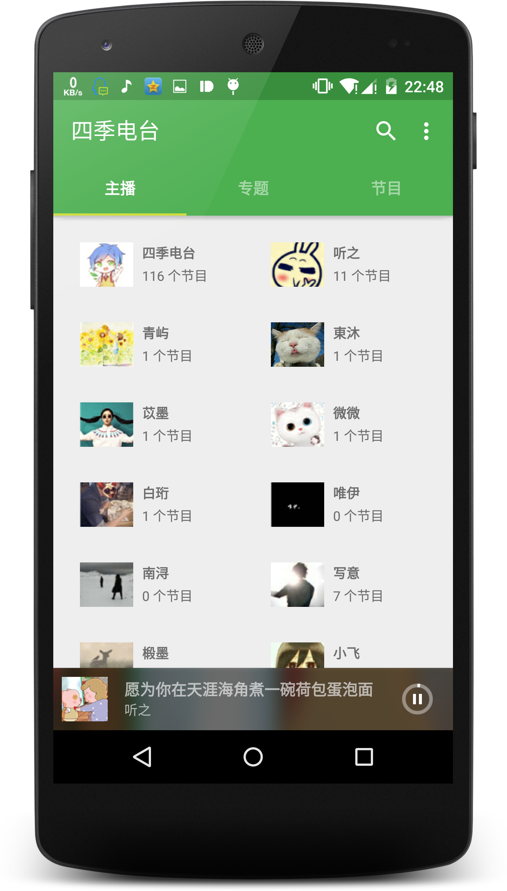
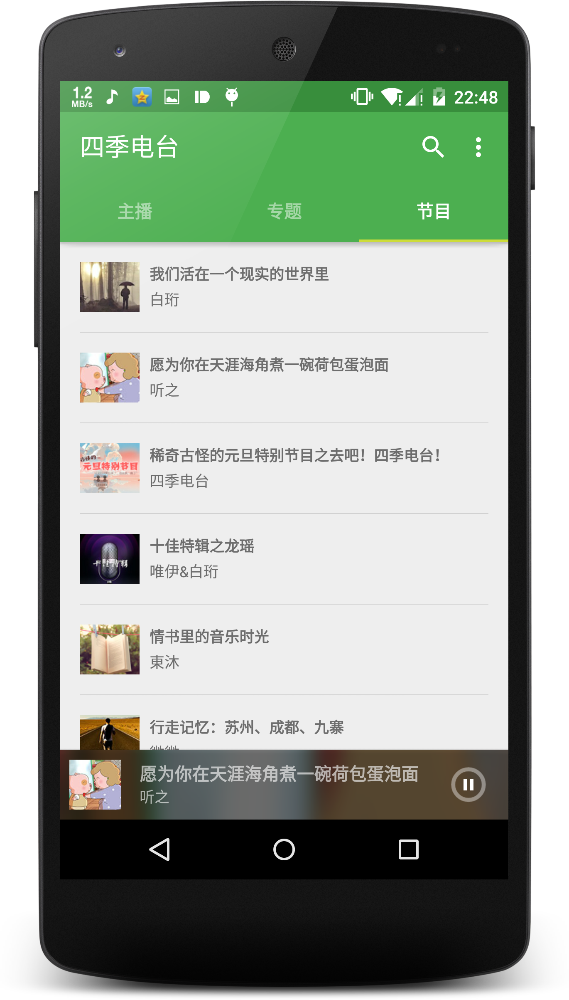
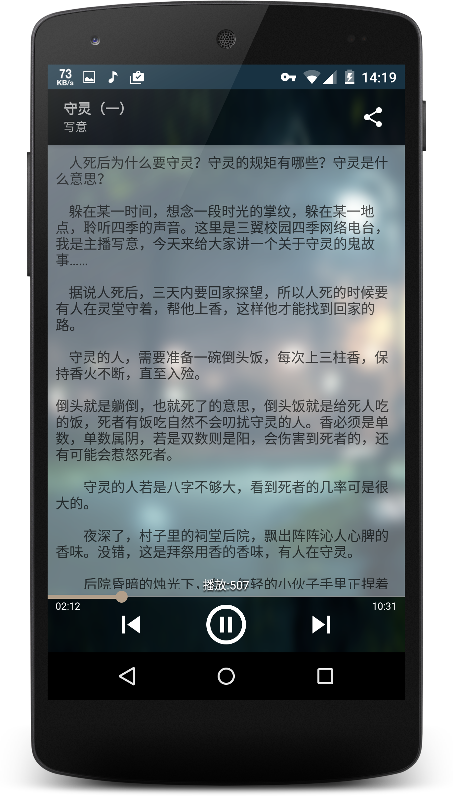

##介绍
四季电台由Dylan(www.linht.net.cn) 出品，是一款学院风的电台节目。

校园网络电台一枚，
各色主播可供调戏。
有小清新有重口味；
广播小剧专业自制；
神路人档各种乱入。

邮箱：linht39@qq.com

## 界面:
- 主播列表
    
- 节目列表
	
- 播放器
    

## License
Copyright 2015 linroid

Licensed under the Apache License, Version 2.0 (the "License");
you may not use this file except in compliance with the License.
You may obtain a copy of the License at

    http://www.apache.org/licenses/LICENSE-2.0

Unless required by applicable law or agreed to in writing, software
distributed under the License is distributed on an "AS IS" BASIS,
WITHOUT WARRANTIES OR CONDITIONS OF ANY KIND, either express or implied.
See the License for the specific language governing permissions and
limitations under the License.